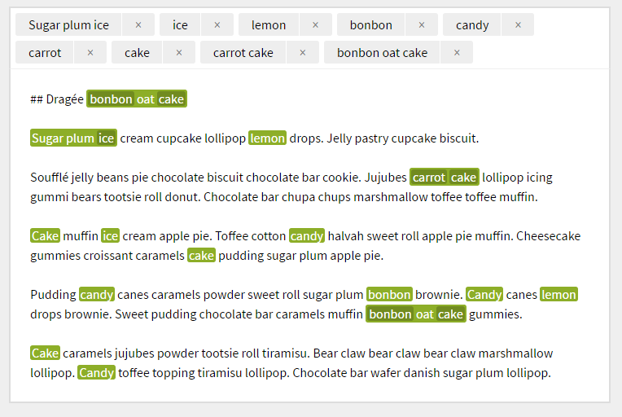
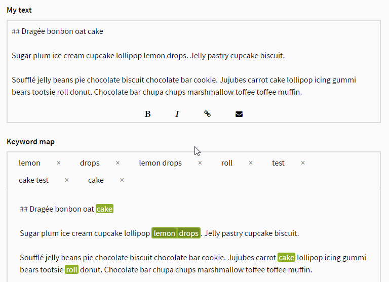

# Kirby Keyword Map

*Version 0.1*

See SEO keywords in your text as a map.

**Screenshot**



**Animation**

Sorry about the buggy animation. The colors are a bit off sometimes.



**Features**

- Support for structure fields
- Support for multiple keyword maps
- Support for mutiple words in a keyword phrase
- Support for multi languages
- Will ignore these characters `['-', '#', ',', '.']`

[**Installation instructions**](docs/installation-instructions.md)

## Setup

This plugin is a panel field and to use it you need to add a blueprint field. You also need a field that has a textarea.

```
fields:
  mytext:
    label: My text
    type: textarea
  keywordmap:
    label: Keyword Map
    type: keywordmap
    target: mytext
```

### `mytext`

It's a textarea that we use to write our content.

### `keywordmap`

Our new field has two required options:

- `type` needs to be `keywordmap`
- `target` needs to be a field that contains a textarea, in this case it's `mytext`.

## Usage

### Add keywords

Click on the top of the field to keyword phrases. Both single and multiple words are allowed in a single keyword phrase. 


### Write text


### Results

With some more keyword phrases and some more text it can look like this:


## Changelog

**0.1**

- Initial release 

## Requirements

- [**Kirby**](https://getkirby.com/) 2.4.1+

## Disclaimer

This plugin is provided "as is" with no guarantee. Use it at your own risk and always test it yourself before using it in a production environment. If you find any issues, please [create a new issue](https://github.com/jenstornell/kirby-keyword-map/issues/new).

## License

[MIT](https://opensource.org/licenses/MIT)

It is discouraged to use this plugin in any project that promotes racism, sexism, homophobia, animal abuse, violence or any other form of hate speech.

## Credits

- [Jens Törnell](https://github.com/jenstornell)
- [mark.js](https://markjs.io) - Javascript to hightlight keywords in a text